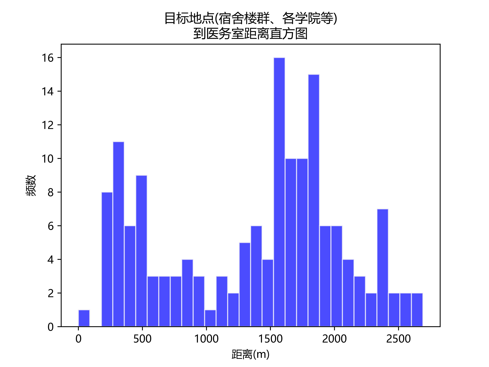
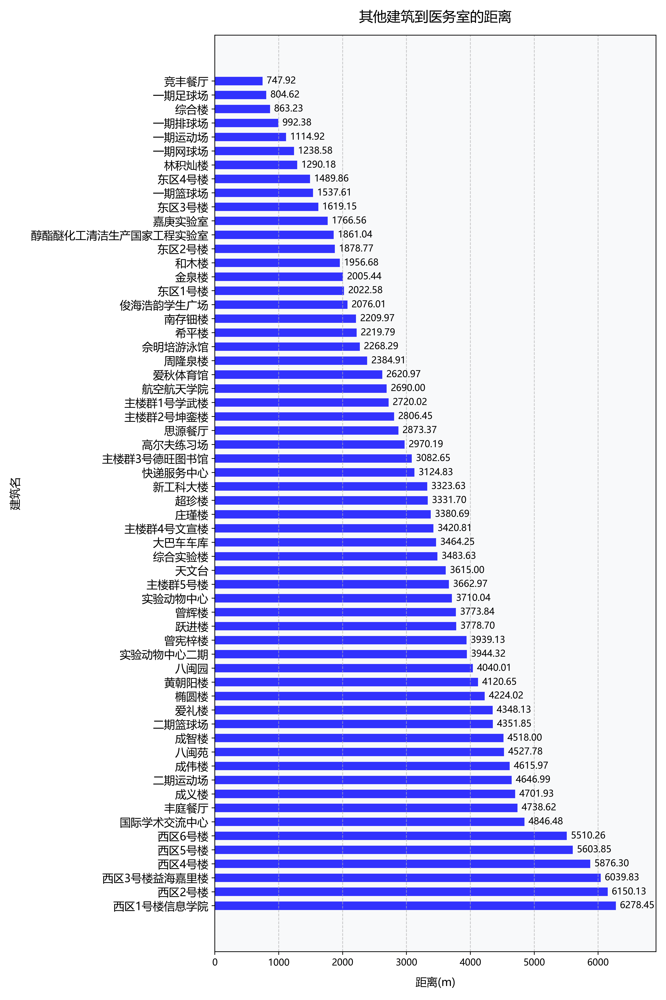
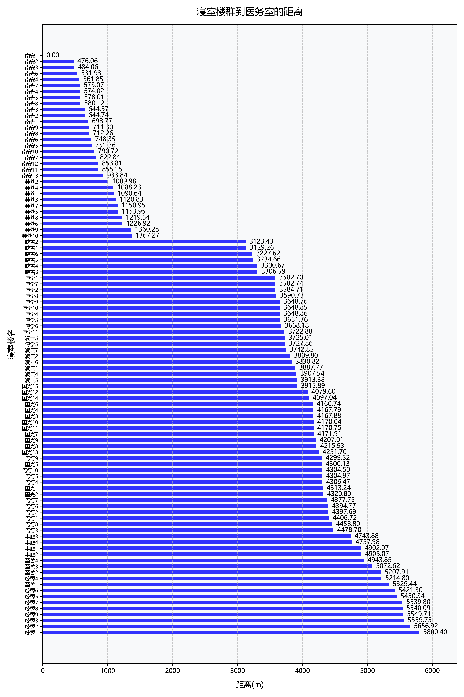

# Get-the-best-position-of-new-clinic-for-university

## 前言

此项目针对厦门大学翔安校区医务室较少的问题，给出了初步的方案——新增一个医务室，并给出了推荐的几个位置

## 仓库内的文件介绍

一共有5个文件夹，分别是`data_origin`、`data_processed`、`include`、`pic`、`useless`，其中，前三个文件夹分别存放了厦门大学翔安校区的平面地图、项目处理过程中产生的数据文件、一些简单的自定义模块。而在include中，包含三个小模块，分别是`fileload`、`picture`、`process`，分别用于数据文件的导入、图像的处理和最优路线查找。

最优路线查找使用了简单的dijkstra算法，一共有两个，dijkstra_o的时间复杂度较高，dijkstra使用优先队列加以优化，耗时较少，使用时，将名字进行更改并测试，可以明显地感知到耗时的区别

主目录下共6个文件，使用时一一运行。

在使用`main_1地图数据标注.py`文件时，需要手动标注节点和连接线，在第二个程序执行确认无误之后，可执行第三个程序输出路线规划图

不过可惜的是，在地图数据标注时，需要人工区分起点、终点（所有的寝室楼和其他建筑物）、道路节点，这也是本项目的不足之处。经过后续的操作，能够得到距离的直方图，各个地点到医务室距离的条形图，不同情况下的医务室位置情况，具体可见`pic`文件夹

## 下面是直方图

## 下面是建筑到医务室的距离条形图

## 下面是寝室楼到医务室的距离条形图

